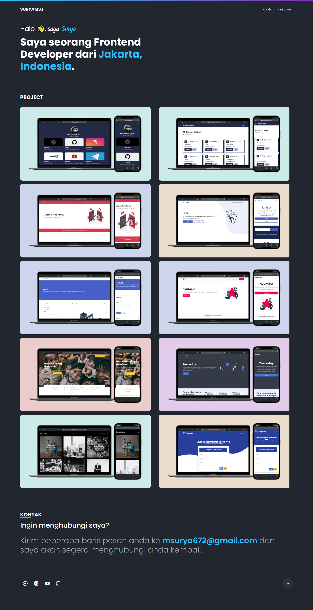

<div align="center" id="top"> 
  

  &#xa0;

  <a href="https://suryamsj-old.netlify.app/">Demo</a>
</div>

<h1 align="center">Svelte Portfolio</h1>

<p align="center">
  

  

  

  

  
</p>

<!-- Status -->

<!-- <h4 align="center"> 
	🚧  Svelte Portfolio 🚀 Under construction...  🚧
</h4> 

<hr> -->

<p align="center">
  <a href="#dart-about">About</a> &#xa0; | &#xa0; 
  <a href="#rocket-technologies">Technologies</a> &#xa0; | &#xa0;
  <a href="#white_check_mark-requirements">Requirements</a> &#xa0; | &#xa0;
  <a href="#checkered_flag-starting">Starting</a> &#xa0; | &#xa0;
  <a href="#memo-license">License</a> &#xa0; | &#xa0;
  <a href="https://github.com/suryamsj" target="_blank">Author</a>
</p>

<br>

## :dart: About ##

Web portfolio yang dibuat menggunakan Svelte. Sebenarnya ini hanya berupa css,html dan js biasa. Namun, saya merubahnya menjadi mengunakan Svelte, karna saya ingin menambahkan beberapa fitur di web portfolio saya.

## :rocket: Technologies ##

Teknologi yang digunakan untuk membangun svelte-portfolio:

- [Svelte](https://svelte.dev/)
- [Bootstrap 5](https://getbootstrap.com/)
- [Uniicons](https://iconscout.com/unicons/explore/line)
- [Google Fonts](https://fonts.google.com/)

## :white_check_mark: Requirements ##

Sebelum memulai :checkered_flag:, pastikan sudah menginstall [Git](https://git-scm.com) dan [Node](https://nodejs.org/en/).

## :checkered_flag: Starting ##

```bash
# Clone this project
$ git clone https://github.com/suryamsj/svelte-portfolio

# Access
$ cd svelte-portfolio

# Install dependencies
$ npm install

# Run the project
$ npm run dev

# The server will initialize in the <http://localhost:5173>
```

## :memo: License ##

This project is under license from MIT. For more details, see the [LICENSE](LICENSE.md) file.


Made with :heart: by <a href="https://github.com/suryamsj" target="_blank">Muhammad Surya Jayadiprana</a>

&#xa0;

<a href="#top">Back to top</a>
